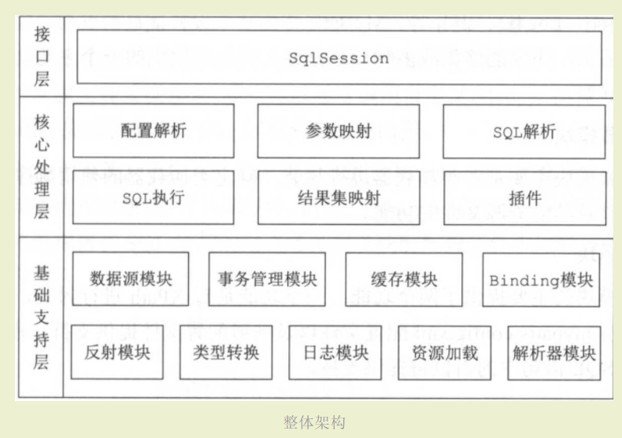
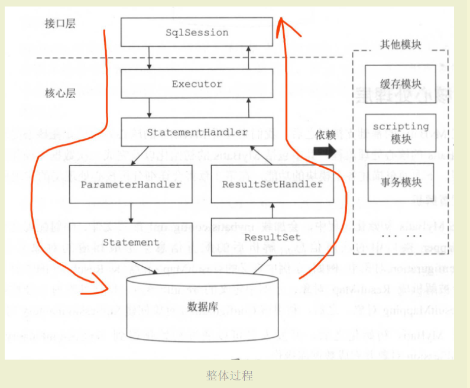
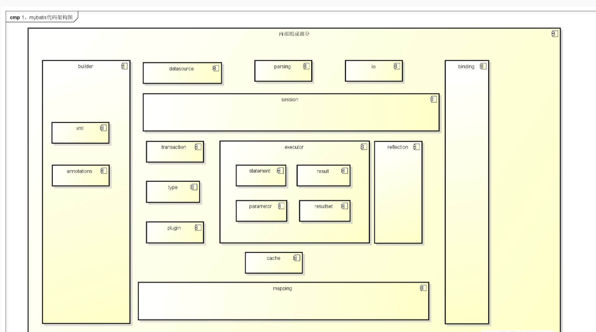

MyBatis 的整体架构分为三层：

1.基础支持层
2.核心处理层
3.接口层

基础支持层 => 核心处理层 => 接口层

****
基础支持层

1.反射模块
对应 reflection 包

`Java 中的反射虽然功能强大，但对大多数开发人员来说，写出高质量的反射代码还是 有一定难度的。
MyBatis 中专门提供了反射模块，该模块对 Java 原生的反射进行了良好的封装，提了更加简洁易用的 API，方便上层使调用，
并且对反射操作进行了一系列优化，例如缓存了类的元数据，提高了反射操作的性能
`

2.类型模块
对应 type 包

`
① MyBatis 为简化配置文件提供了别名机制，该机制是类型转换模块的主要功能之一。
② 类型转换模块的另一个功能是实现 JDBC 类型与 Java 类型之间的转换，
该功能在为 SQL 语句绑定实参以及映射查询结果集时都会涉及：
    在为 SQL 语句绑定实参时，会将数据由 Java 类型转换成 JDBC 类型。
    而在映射结果集时，会将数据由 JDBC 类型转换成 Java 类型。
 `
 
3.日志模块
对应 logging 包

4.IO 模块
对应 io 包

5.解析器模块
对应 parsing 包

6.数据源模块
对应 datasource 包

7.事务模块
对应 transaction 包

8.缓存模块
对应 cache 包

9.Binding 模块
对应 binding 包

`在调用 SqlSession 相应方法执行数据库操作时，需要指定映射文件中定义的 SQL 节点，
如果出现拼写错误，我们只能在运行时才能发现相应的异常。
为了尽早发现这种错误，MyBatis 通过 Binding 模块，
将用户自定义的 Mapper 接口与映射配置文件关联起来，
系统可以通过调用自定义 Mapper 接口中的方法执行相应的 SQL 语句完成数据库操作，从而避免上述问题`

10.注解模块
对应 annotations 包

11.异常模块
对应 exceptions 包

****

核心处理层

1.配置解析
对应 builder 和 mapping 模块。前者为配置解析过程，后者主要为 SQL 操作解析后的映射

2.SQL 解析
对应 scripting 模块

3.SQL 执行
对应 executor 和 cursor 模块。前者对应执行器，后者对应执行结果的游标
 
Executor 主要负责维护一级缓存和二级缓存，并提供事务管理的相关操作，
它会将数据库相关操作委托给 StatementHandler完成。
 
StatementHandler 首先通过 ParameterHandler 完成 SQL 语句的实参绑定，
然后通过 java.sql.Statement 对象执行 SQL 语句并得到结果集，最后通过 ResultSetHandler 完成结果集的映射，
得到结果对象并返回。

整体执行流程图：

 

****
接口层
对应 session 模块。

****
1 JDBC 模块
对应 jdbc 包。

JDBC 单元测试工具类。所以，不感兴趣的同学，已经可以忽略 1236 行代码了。

2 Lang 模块
对应 lang 包。

****
整体架构图
